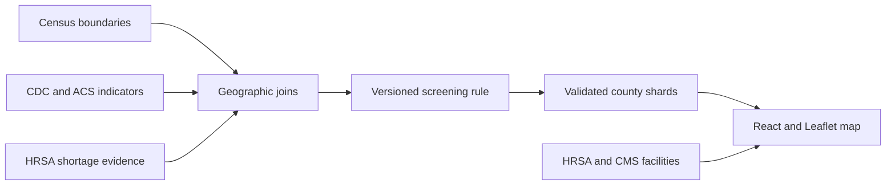

# CareAtlas NJ

[](https://github.com/methmoussa/careatlas-nj/actions/workflows/test.yml)
[](LICENSE)
[](https://careatlas.lmayzel930.workers.dev)

CareAtlas NJ is a deployed public-data integration and explanation system for New Jersey healthcare access. It brings Census, CDC, HRSA and CMS evidence into one interface spanning all 21 counties, 564 towns/townships and 2,181 census tracts. People can explore 215 source-backed healthcare facility locations—hospitals and community health centers—search a clearly labeled 734-location doctor-office pilot, and inspect tract screening results whose inputs, rule version, source dates and limitations remain visible.

[Explore the live app](https://careatlas.lmayzel930.workers.dev) · [Read the project story](https://careatlas.lmayzel930.workers.dev/story) · [Review the submission package](docs/submission/README.md)


> **CareAtlas is a screening and planning tool—not medical advice, a diagnosis, a provider ranking, or proof that care is unavailable.**

## What makes it different

CareAtlas does not infer healthcare access from map pins or hide evidence inside a black-box score. Its contribution is the integration and explanation layer:

- Join official public-health and geography evidence with consistent identifiers.
- Preserve missing values, source versions and row-level provenance instead of filling gaps silently.
- Apply a published, versioned screening rule and validate all 2,181 generated tract records.
- Keep facility and doctor-office locations separate from the screening calculation.
- Package each result with readable reasoning, source dates, limitations and shareable records.

That design makes complex public evidence easier to inspect without claiming to diagnose individuals, rank providers or prove that care is available or unavailable.

## What it includes

- Search across all 564 New Jersey municipalities or locate a Census tract from a street address.
- Explore 2,181 tract results produced by a transparent, versioned screening rule.
- Distinguish potential access gaps, elevated need without matched shortage evidence, no current flag, and insufficient evidence.
- Open a shareable evidence brief with rule inputs, source dates, limitations, and downloads.
- View 215 source-backed hospitals and community health centers as context.
- Explore a separate 734-location doctor-office pilot for pediatrics, dermatology, and oncology.


Purple tracts are classified as **potential access gaps**: elevated community-health need or social barriers appear alongside reviewed primary-care shortage evidence. Facility and office pin counts never determine this flag. See the [published rule](docs/batch-7-transparent-flagging.md) for the exact thresholds and state precedence.

## How it works



The data pipeline preserves geographic identifiers, missing values, source versions, and row-level provenance. Generated artifacts are validated before the Vite build, and the production bundle excludes staging records, source archives, and test fixtures.

## Run locally

Requirements: [Node.js 24](https://nodejs.org/) and npm.

```sh
git clone https://github.com/methmoussa/careatlas-nj.git
cd careatlas-nj
npm ci
npm run dev
```

Open the URL printed by Vite, normally `http://localhost:5173`. The local API runs on port `8787`. The core map, checked-in data, and tests need no account or API key.

The optional plain-language Gemini explainer requires a server-side `GEMINI_API_KEY`. Copy `.env.example` to `.env` only when configuring that feature; it is not needed to calculate or display screening results.

## Verify the project

```sh
npm test
```

The full check runs UI tests, data and provenance validators, importer fixtures, public-map assertions, the production build, local HTTP checks, and a Cloudflare packaging dry run. CI runs the same command on Linux and Windows.

For focused development:

```sh
npm run test:ui
npm run check:changed
npm run build
```

See [testing](docs/testing.md) for the check matrix and troubleshooting notes. The [demo-readiness checklist](docs/demo-readiness-checklist.md) provides a focused pre-release review.

## Project structure

| Path | Purpose |
| --- | --- |
| `src/` | React interface, map behavior, types, and UI tests |
| `server/` | Local Node server and address/explanation API routes |
| `worker/` | Cloudflare Worker API adapter |
| `scripts/` | Import, review, generation, and validation tooling |
| `public/data/` | Published runtime data, source archives, and isolated fixtures |
| `docs/` | Methods, data contracts, deployment, and review records |

The development-only review route (`/internal-data`) is excluded from production builds.

## Sources and limitations

CareAtlas integrates U.S. Census Bureau geography and ACS data, CDC PLACES, CDC/ATSDR SVI, HRSA shortage areas and health centers, and CMS hospital/provider data. Source versions, checked dates, attribution, reuse notes, and AI-assistance disclosures are recorded in the [contribution and provenance inventory](docs/submission/contribution.md).

Important limits:

- A flag identifies a combination of published indicators; it does not predict an individual's access to care.
- No current flag does not prove adequate access.
- Missing required evidence remains an explicit result instead of being treated as zero.
- The facility and doctor-office layers are not complete provider directories.
- Resident usability sessions and an independent public-health/GIS methods review remain future work.

## Deployment

```sh
npm run build
npm start
```

This serves the production website and API on `http://localhost:8787`. See the [deployment guide](docs/deployment-guide.md) for Node and Cloudflare instructions.

## Contributing and license

Read [CONTRIBUTING.md](CONTRIBUTING.md) before changing data, screening behavior, or public-health copy. Source code is available under the [MIT License](LICENSE); upstream datasets retain their publishers' terms and attribution requirements.
