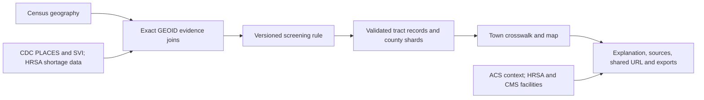

# CareAtlas NJ: contribution and provenance

CareAtlas helps New Jersey residents move from a town name to a small-area screening explanation, the official evidence behind it, and a shareable record. Its contribution is the integration and explanation layer: consistent geographic identifiers, explicit missing values, a readable rule, tract-to-town context and resident-facing briefs. It does not claim to invent the source indicators or to predict individual healthcare outcomes.

The original source publishers supply the measurements and boundaries. CareAtlas imports and normalizes them, preserves provenance, evaluates the published decision logic, validates generated records and serves county-sized files to a React/Leaflet interface. Facility and specialist-office pins provide separate context and never determine a gap flag.

## Pinned sources

Dates below describe metadata in the repository, not claims that every source was refreshed on September 14. Source archives and maintenance scripts remain in the repository; runtime packaging excludes staging and fixtures.

| Source | Version / snapshot | Use and authoritative link |
| --- | --- | --- |
| Census TIGERweb tracts | ACS 2024 service; January 1, 2024 geography; stored check July 11, 2026 | 2,181 NJ tract geometries, [TIGERweb](https://tigerweb.geo.census.gov/arcgis/rest/services/TIGERweb/tigerWMS_ACS2024/MapServer/8) |
| Census county subdivisions | 2024 cartographic boundary, 1:500,000; stored check July 14, 2026 | 564 municipalities, [source ZIP](https://www2.census.gov/geo/tiger/GENZ2024/shp/cb_2024_34_cousub_500k.zip) |
| CDC PLACES | 2025 release, dataset `cwsq-ngmh`; selected estimates 2023; stored check July 14, 2026 | Four health-rule measures and transportation context, [dataset](https://data.cdc.gov/d/cwsq-ngmh) |
| CDC/ATSDR SVI | 2022 New Jersey state database; stored check July 12, 2026; values independently compared September 14 | State-relative overall rank and four themes, [download documentation](https://www.atsdr.cdc.gov/place-health/php/svi/svi-data-documentation-download.html) |
| Census ACS | 2024 five-year tables B27010, B17001, C18108, B08201; stored check July 12, 2026 | Uninsurance, poverty, disability and vehicle-access context, [summary files](https://www.census.gov/programs-surveys/acs/data/summary-file.html) |
| HRSA shortage areas | Daily-download snapshot recorded July 12, 2026 | Primary-care HPSA and MUA/P rule inputs; dental/mental-health context, [downloads](https://data.hrsa.gov/data/download) |
| HRSA health centers and CMS hospitals | Reviewed snapshots with per-record provenance; dates vary | 153 NJ health centers and 62 hospitals, [HRSA downloads](https://data.hrsa.gov/data/download), [CMS hospitals](https://data.cms.gov/provider-data/topics/hospitals) |
| CMS doctors and clinicians | Data July 31, 2026; release August 13; checked August 30 | 734 unique NJ offices across three specialty categories, [dataset mj5m-pzi6](https://data.cms.gov/provider-data/dataset/mj5m-pzi6) |
| CMS NPPES; Census geocoder | NPPES deactivation report August 10, 2026; checked August 30 | Provider-status and location checks, [NPPES](https://download.cms.gov/nppes/NPI_Files.html), [geocoder](https://geocoding.geo.census.gov/geocoder/Geocoding_Services_API.html) |

For exact per-family counts and source URLs, inspect `public/data/tracts/nj/*coverage-summary.json`, `public/data/tracts/nj/town-foundation/summary.json`, each facility's provenance and `public/data/doctor-offices/nj.json`. Specialty counts overlap when an office offers multiple specialties.

## Attribution and reuse

CareAtlas code is [MIT licensed](../../LICENSE). This does not relicense upstream material. CDC/ATSDR generally permits reuse of agency-produced public-domain content, with exceptions for third-party material and protected marks: [agency materials policy](https://www.cdc.gov/other/agencymaterials.html). Census's [public-access policy](https://www2.census.gov/foia/ds_policies/ds027.pdf) describes the status of employee-created data and works. CMS describes general reuse and possible dataset-specific restrictions in its [API FAQ](https://data.cms.gov/sites/default/files/2022-08/API%20FAQ%20v1_0.pdf). Retain source attribution and dataset-specific notices; do not imply agency endorsement.

HRSA source links and provenance are retained. This review did not verify a dataset-specific HRSA license grant; confirm applicable notices before representing the entire data bundle as freely relicensable. Provider websites and their content retain their owners' rights. Map road layers use [OpenStreetMap data under ODbL](https://www.openstreetmap.org/copyright) and, in clean mode, CARTO tiles with the attribution embedded in the map. Third-party service availability and terms are separate from local app licensing.

## Development and AI assistance

The author confirms that implementation began **August 1, 2026** and that substantially the same project has never been entered elsewhere. GitHub history begins September 5, when an existing local worktree was uploaded in installments through September 12. Those commits document publication of the worktree, not day-by-day development. September 13 cleanup made local setup and tests self-contained. September 14 review corrected SVI labels, broadened print availability and added this submission package.

The imported worktree contains earlier June/July date fields in source, review and generated artifacts, including CareAtlas-specific planning and promotion reports. The author confirms that those fields do **not** record implementation activity. They remain visible rather than being silently rewritten, and they must not be presented as development milestones. Because no contemporaneous pre-import Git history is available, the August 1 start is an author attestation rather than an independently verified date. See the [methods review](methods-review.md).

OpenAI ChatGPT/Codex assisted with code changes, debugging, tests, repository organization, documentation, browser QA and submission preparation. Gemini is an optional runtime explanation feature; it is disabled on the live site as checked September 14. It does not calculate flags. Do not claim the project was written without AI assistance or that AI review supplied human validation.

Suggested Built With: React, TypeScript, Vite, Tailwind CSS, Leaflet, React Leaflet, Node.js, Cloudflare Workers, Vitest, Census/TIGERweb/ACS, CDC PLACES, CDC/ATSDR SVI, HRSA, CMS/NPPES, OpenAI ChatGPT/Codex; optional Google Gemini integration (disabled in this demo).
